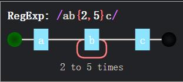
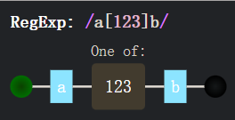
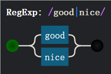

# 正则表达式匹配模式

## 两种模糊匹配

> 如果正则中只有像`/hello/`用一样的精确匹配是没有意义的

* 模糊匹配:两个方向上的模糊.**横向模糊**和**纵向模糊**

### 横向模糊

> 横向模糊指的是正则可匹配的字符串的长度不是固定的,可以是多种情况

* **量词**是横向模糊的实现方式.
  * 例如`/ab{2,5}c/`.他会在匹配`b`的时候匹配2~5次
  * 

### 纵向模糊匹配

>纵向模糊匹配指的是,一个正则匹配的字符串,具体到某一位字符时,它可以不是某一个确定的字符,可以有多种可能

* **字符组**是其实现的方式.
  * 例如`/a[123]b/`,可以匹配如下三种字符串:`a1b`,`a2b`,`a3b`
  * 

## 字符组

>字符组皮皮额的只是其中的一个字符.
>  
>例如`[abc]`.它可以是`a`,`b`,`c`之一

1. 范围表示.可以使用`-`来省略或者简写
   * 例如`[123456abcdefg]`可以表示为`[1-6a-g]`
   * 如果匹配连字符`-`和字母那么需要转义护着写成如下
     * `[a\-z]`,`[-az]`,`[az-]`
2. 排除字符组.`^`
   * **纵向模糊**匹配时,某位字符可以是任何东西,但是不能是`a`,`b`,`c`
   * 此时就是排除字符组(**反义字符组**).例如`[^abc]`,表示除`a`,`b`,`c`之外的任意一个字符
3. 常见的简写方式

 | 字符组 | 具体含义                                                                     |
 | ------ | ---------------------------------------------------------------------------- |
 | \w     | [0-9a-zA-Z_].表示数字,大小写字母和下划线                                     |
 | \W     | [^0-9a-zA-Z_].表示非单词字符                                                 |
 | \d     | 等价于[0-9].表示一位数字                                                     |
 | \D     | 等价于[^0-9].表示除数字外的任意字符                                          |
 | \s     | [ \t\v\n\r\f].表示空白符,包括空格,水平制表符,垂直制表符,换行符,回车符,换页符 |
 | \S     | [^ \t\v\n\r\f].非空白符                                                      |
 | .      | [^\n\r\u2028\u2029].通配符,任意字符.除换行符,回车符,行分隔符和分隔符         |

* 如果需要匹配任意字符.可以使用`[\d\D]`,`[\w\W]`,`[\s\S]`,`[^]`

## 量词

1. 量词的简写形式

   | 量词 | 具体含义                                     |
   | ---- | -------------------------------------------- |
   | {m,} | 表示至少出现m次                              |
   | {m}  | 等价于`{m,m}`.表示出现m次                    |
   | ?    | 等价于`{0,1}`.表示出现或者不出现             |
   | \+   | 等价于`{1,}`,表示至少出现一次                |
   | \*   | 等价于`{0,}`,表示出现任意任意次数.可能不出现 |

   * 

2. 贪婪匹配与惰性匹配

   ```js
   let regex = /\d{2,5}/g
   let string = "123 1234 12345 123456"
   console.log(string.match(regex))
   //['123', '1234', '12345', '12345']
   ```

   * 其中正则`/\d{2,5}/`表示数字连续出现`2~5`次,会匹配2位,3位,4位,5位的连续数字
   * 由于其是贪婪的,会尽可能多的匹配,直到情况不满足

   ```js
   let regex = /\d{2,5}?/g
   let string = "123 1234 12345 123456"
   console.log(string.match(regex))
   //['12', '12', '34', '12', '34', '12', '34', '56']
   ```

   * 惰性匹配是尽可能少的匹配
   * 其中`/d{2,5}?/`表示虽然2~5次都行.只要有两个就够了,就不需要再往下尝试

   | 惰性量词 | 贪婪量词 |
   | -------- | -------- |
   | {m,n}?   | {m,n}    |
   | {m,}?    | {m,}?    |
   | ??       | ?        |
   | +?       | +        |
   | *?       | *        |

   * 

## 多选分支

> 一个模式可以实现横向和纵向模糊匹配.多选分支可以支持多个子模式任选其一

* 例如`(p1|p2|p3)`,其中p1,p2和p3是子模式用`|`(管道符)分割,表示其中的任何之一
* 例如要匹配字符串`good`和`nice`.可以使用`/good|nice/`
  * 
* 但是当使用`/good|goodbye/`去匹配`goodbye`字符串的时候,结果是`good`
  
  ```js
  let regex = /good|goodbye/g
  let string = "goodbye"
  console.log(string.match(regex))
  //['good']
  ```

  * 分支结构也是惰性的,只要当前面的匹配上,后面的就不会尝试

## 案列

1. 匹配16进制颜色.要求匹配`#ffbbad`,`#aFF`...
   * 其中字符可以出现3或者6次,需要使用量词和分支结构
   * `/#([0-9a-fA-F]{6}|[0-9a-fA-F]{3})/`
2. 匹配时间:以24小时时间为例
   * 总共四位数字,第一位可以是`[0-2]`
   * 如果第一位为2,第二位只能是`[0-3]`.其他情况是`[0-9]`
   * 第三位是`[0-5]`.第四位是`[0-9]`
   * `/^([0-1][0-9]|2[0-3])[0-5][0-9]$/`
3. 匹配`yyyy-mm-dd`
   * `/[0-9]{4}-(0[1-9]|1[1-2])-(0[1-9]|[12][1-9]|3[01])/`
4. 匹配windows操作系统文件路径
   * `/^[a-zA-Z]:\\([^\\:*<>|"?\r\n/]+\\)*([^\\:*<>|"?\r\n/]+)?$/`
