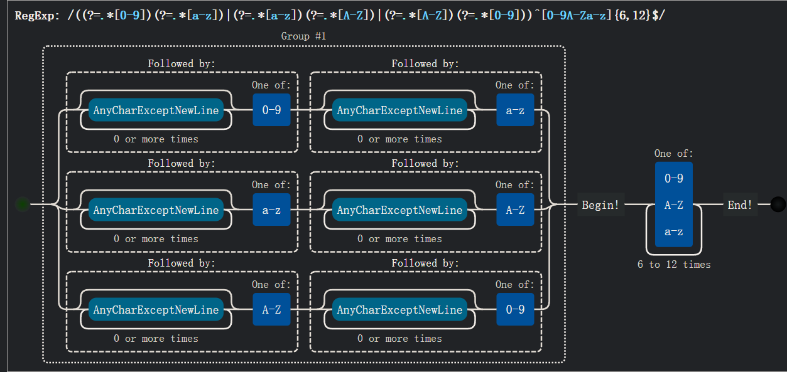

# 正则表达式的位置匹配模式

* 图中的箭头值的就是位置
* 

## 位置匹配

>`^`,`$`,`\b`,`\B`,`(?=p)`,`(?!p)`

1. `^`和`$`
   * `^`匹配开头,在多行匹配中匹配行开头
   * `$`匹配结尾,在多行匹配中匹配行结尾

   ```js
   let result = "hello".replace(/^|$/g,"#")
   //#hello#
   ```

   * 如果是多行匹配模式(即有修饰符`m`的时候).二者是行的概念

   ```js
   let result = "hello\njack".replace(/^|$/gm, "#")
   //#hello#
   //#jack#
   ```

2. `\b`和`\B`
   * `\b`是单词边界,具体是指`\w`和`\W`之间的位置,也包括`\w`与`^`之间的位置,和`\w`与`$`之间的位置

   ```js
   let result = "[js] regular_01.js".replace(/\b/g, "#")
   ```

   >`\w`是字符组`[0-9a-zA-Z_]`的简写形式.而`\W`是排除字符组,即\W是\w以外的任意一个字符

   1. 两边字符`[`和`j`,是`\w`和`\W`之间的位置
   2. 两边字符`s`和`]`,是`\w`和`\W`之间的位置
   3. 两边字符`空格`和`r`,`\w`和`\W`之间的位置
   4. 两边字符`1`和`.`,`\w`和`\W`之间的位置
   5. 两边字符`.`和`j`,`\w`和`\W`之间的位置
   6. 两边字符`s`和`空格`,`\w`和`\W`之间的位置

   * `\B`是`\b`的反面的意思,不i傲视非单词边界,将字符串中所有的位置,扣掉`\b`,剩下的都是`\B`

   ```js
   let result = "[js] regular_01.js".replace(/\B/g, "#")
   //#[j#s]# r#e#g#u#l#a#r#_#0#1.j#s
   ```

3. `(?=p)`和`(?!p)`.(正向先行断言和负向先行断言)
   * `(?=p)`,其中`p`是一个子模式,即p前面的位置,或者说,该位置后面的字符要匹配p

   ```js
   let result = "hello".replace(/(?=l)/g, "#")
   //he#l#lo
   ```

   * `(?!p)`,表示的是`(?=p)`相反的位置

   ```js
   let result = "hello".replace(/(?!l)/g, "#")
   //#h#ell#o#
   ```

   * `(?<=p)`表示p后面的位置.`(?<!p)`表示`(?<=p)`相反的位置

   ```js
   let result = "hello".replace(/(?<=l)/g, "#")
   //hel#l#o
   let result = "hello".replace(/(?<!l)/g, "#")
   //#h#e#llo#
   ```

## 位置的特性

>对于位置的理解,可以理解成空字符`""`

* 比如`hello`就可以等价于
  * `"hello" === "" + "" + "h" + "ello"`

* 例如把`/^hello$/`可以写成`/^^hello$$$/`
* 或者写成更复杂的

```js
/(?=h)^^he(?=\w)llo$\b\b$/.test('hello')//true
```

## 案例

1. 不匹配任何字符:`/.^/`.该字符后面是开头,这样的字符串是不存在的
2. 数字的千分位分割.将`12345678`->`12,345,678`

   * 匹配最后一个逗号,`(?=\d{3}$)`匹配`\d{3}$`前面的位置.但是`\d{3}$`匹配的是目标字符串最后的那3位

   ```js
   "12345678".replace(/(?=\d{3}$)/g, ",")
   //12345,678
   ```

   * 因为逗号出现的位置.`\d{3}`至少出现一次.需要使用量词`+`

   ```js
   "12345678".replace(/(?=(\d{3})+$)/g, ",")
   //12,345,678
   ```

   * 但是如果数字是3的倍数,开头也会被匹配.例如`123`-->`,123`
     * 由于上面的正则是从后向前匹配,一但是3的倍数,就会将前面的位置替换成`,`
     * 匹配开头可以使用`^`但是这不是开头
     * `(?!^)`:表示与开头相反的位置(除了开头)

   ```js
   "123456789".replace(/(?=(\d{3})+$)(?!^)/g, ",")
   //123,456,789
   ```

   * 如果想支持其他形式.`123456789 123456789`->`123,456,789 123,456,789`
     * 这里将`^`和`$`都改成`\b`(单词边界)

   ```js
   "123456789".replace(/(?=(\d{3})+\b)(?!\b)/g, ",")
   ```

     * `(?!\b)`表示的不是单词边界前面的位置,也就是`\B`
     * `/(?=(\d{3})+\b)\B/`
3. 验证密码问题.密码长度6-12位,由数字,小写字符和大写字母组成,但必须至少包括2种字符
   * 任意一种:`/^[0-9a-zA-Z]{6,12}$/`
   * 如果判断是否包含某一种字符
     * `(?=.*[0-9])`可以判断至少包含某一种字符:`/(?=.*[0-9])^[0-9a-zA-Z]{6,12}$/`

     ```js
     //实际上转化为同时包含数字和小写字母或数字和大写字母或大写字母和小写字母或三者都包含
     const reg =/((?=.*[0-9])(?=.*[a-z])|(?=.*[a-z])(?=.*[A-Z])|(?=.*[A-Z])(?=.*[0-9]))^[0-9a-zA-Z]{6,12}$/
     ```

   * 
   * 只需要理解`(?=.*[0-9])^`即可
   * 先是`?=.*`匹配的字符是任意的,然后`[0-9]`表示接下来必须是数字
   * `(?=.*[0-9])`和`^`都是开头,可以类比之前的位置(都是同一个位置)

   >或者可以这么想:不能全部是数字,也不能全部是小写或者大写字母

   ```js
   reg = /(?!^[0-9]{6,12})(?!^[a-z]{6,12})(?!^[A-Z]{6,12})^[0-9a-zA-Z]{6,12}$/
   ```

   * 
