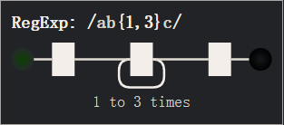

# 正则表达式回溯法原理

## 没有回溯的匹配

>假设正则是`/ab{1,3}c/`,并且其可视化的形式是



* 而当其目标字符串是`abbbc`时,就没有回溯
* 其中的`b{1,3}`表示的就是b出现1~3次


## 有回溯的匹配

> 如果目标的字符串时`abbc`,中间就有回溯


在第五步匹配时失败.当`b{1,3}`已经匹配到第二个字符`b`,准备尝试第三个,结果发现接下来的字符是`c`.此时就认为`b{1,3}`已经匹配完毕.然后状态又回到之前的状态(第六步:即第四步的状态),最后使用子表达式`c`去匹配字符c.

* 使用`/".*"/`匹配目标字符串`"abc"de`


* 在使用`.*`非常影响效率,为了减少不必要的回溯.可以使用`"[^*]*"`

## 常见的回溯形式

> 本质上就是深度优先搜索算法.其中退到之前的某一步这一过程,称之为回溯

回溯法也称试探法,它的基本思想是:从问题的某一种状态(初始状态)出发,搜索从这种状态出发所能达到的所有"状态",当一条路走到"尽头"的时候(不能再前进),再后退一步或若干步,从另一种可能"状态"出发,继续搜索,直到所有的"路径"(状态)都试探过.这种不断"前进",不断"回溯"寻找解的方法,就称作"回溯法".

1. 贪婪量词.
   * 之前的例子都是**贪婪量词**相关的.比如`b{1,3}`,因为其是贪婪的,尝试尽可能的顺序是从多往少的的方向去尝试.首先会尝试`bbb`,然后在看整个正则是否能匹配.不能匹配时,吐出一个`b`,即在`bb`的基础上继续尝试,如果还不行,继续吐出...
   * 如果贪婪量词相互挨着存在,并且相互有冲突,那么越靠前越会尽可能多的去匹配

   ```js
   let str = "12345"
   let reg = /(\d{1,3})(\d{1,3})/
   console.log(str.match(reg))
   //[ '12345', '123', '45', index: 0, input: '12345', groups: undefined ]
   ```

   * 由于深度优先遍历,前面的`\d{1,3}`会匹配`123`,后面的`\d{1,3}`会匹配`45`
2. 惰性量词.
   * 惰性量词就是在贪婪量词后加一个`?`.表示尽可能少的匹配

   ```js
   let str = "12345"
   let reg = /(\d{1,3}?)(\d{1,3})/
   console.log(str.match(reg))
   //[ '1234', '1', '234', index: 0, input: '12345', groups: undefined ]
   ```

   * 其中第一个`\d{1,3}`匹配的时`1`,第二个`\d{1,3}`匹配的时`234`
   * 虽然贪婪量词不贪,但是也有回溯的现象.
     * 例如`/^\d{1,3}\d{1,3}$/`匹配`12345`
     * 
3. 分支结构.
   * 分支结构也是惰性的,比如`/can|candy/`,匹配`candy`的时候,得到的结果是`can`,因为分支会一个个尝试,如果前面的满足,后面就不会再实验了
   * 分支结构,可能前面的子模式hi形成局部匹配,但如果接下来表达式整体不匹配时,任会继续尝试剩下的分支.这种尝试也可以看成一种回溯

   * 例如`/^(?:can|candy)$/`去匹配`candy`的情形
   * 

>有回溯的匹配效率肯定低一些.相对那些DFA引擎(确定型有限自动机)
>
>javascript的正则引擎是NFA(非确定型有限自动机).并且大部分语言都是NFA

* NFA虽然匹配慢,但是编译快
